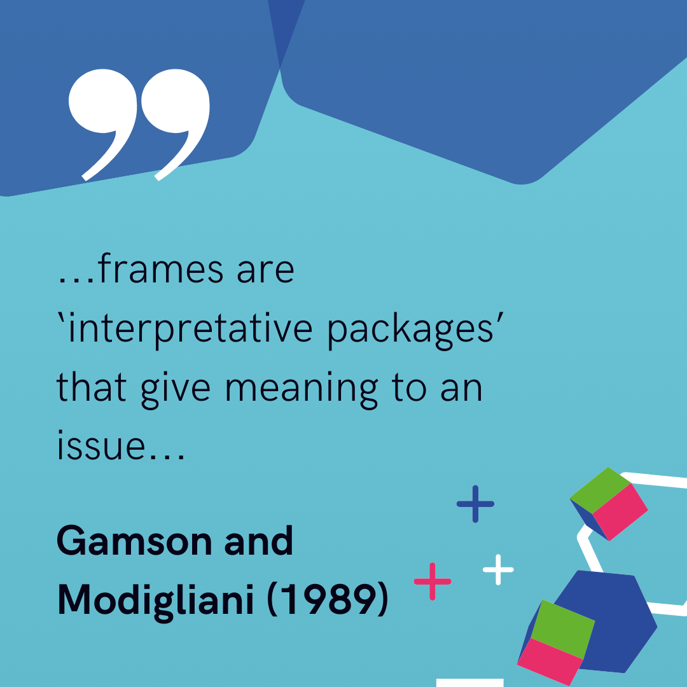
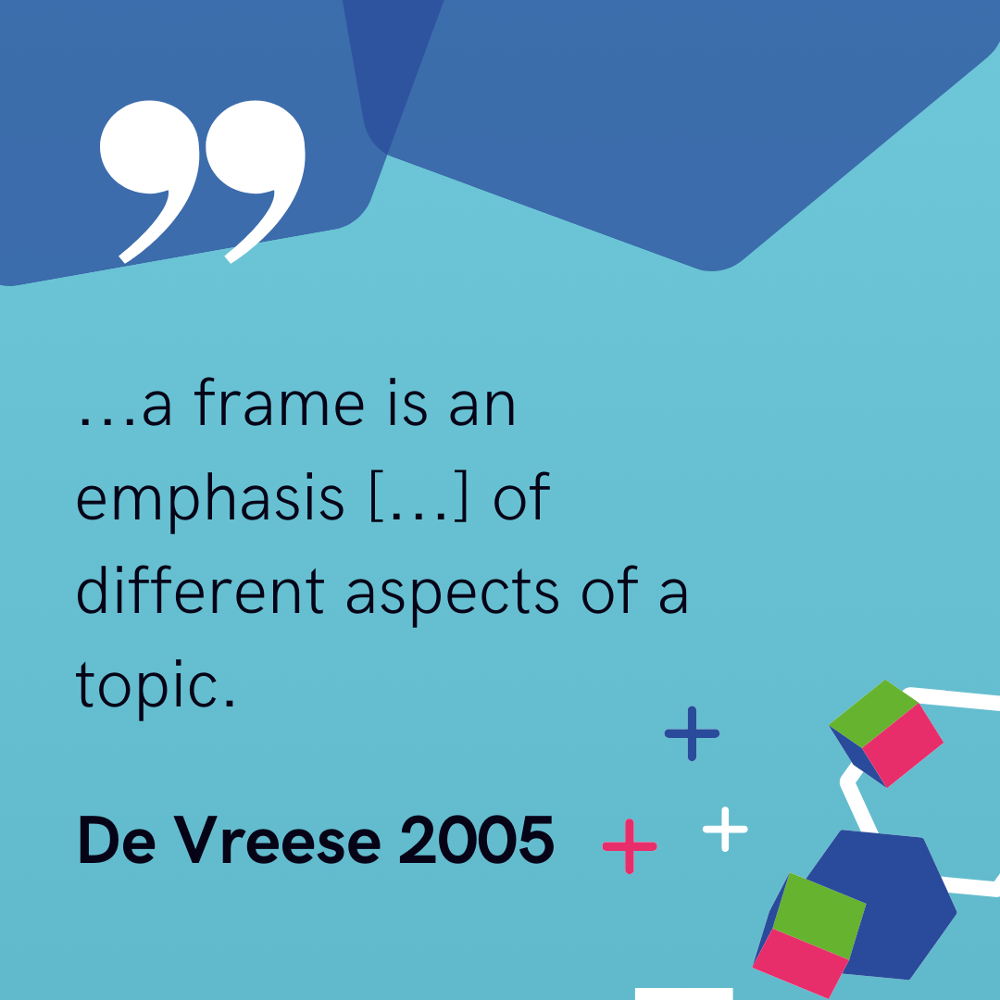
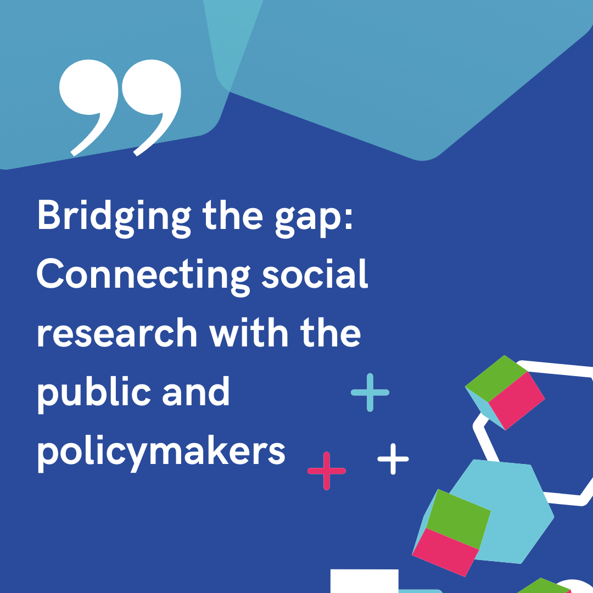
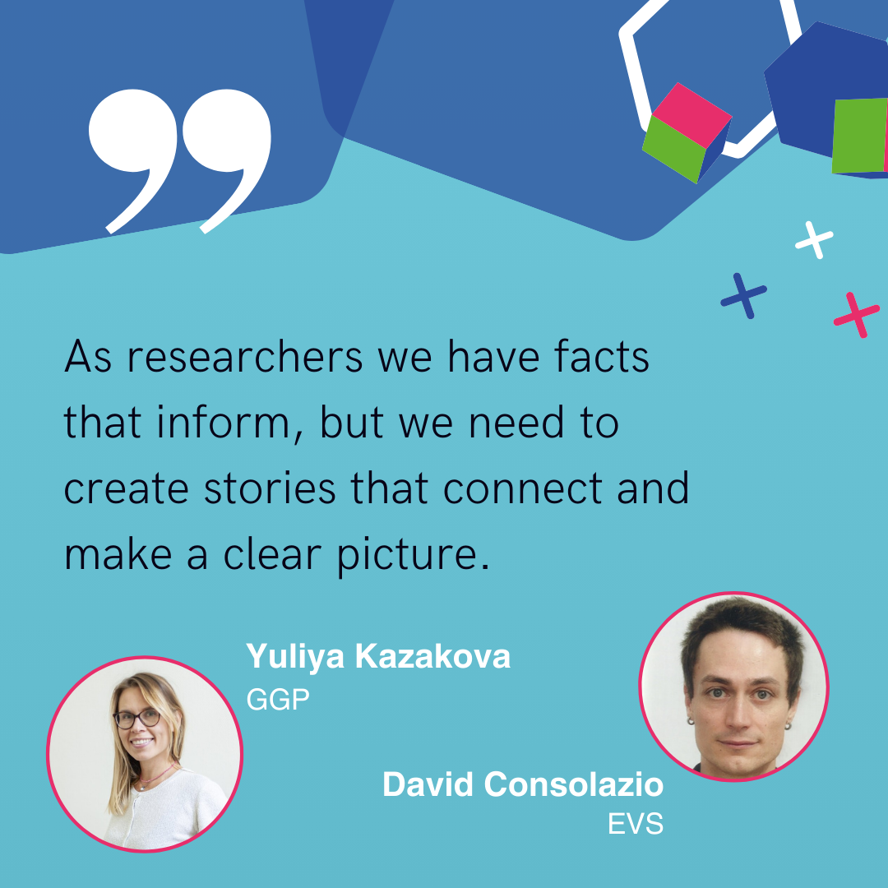
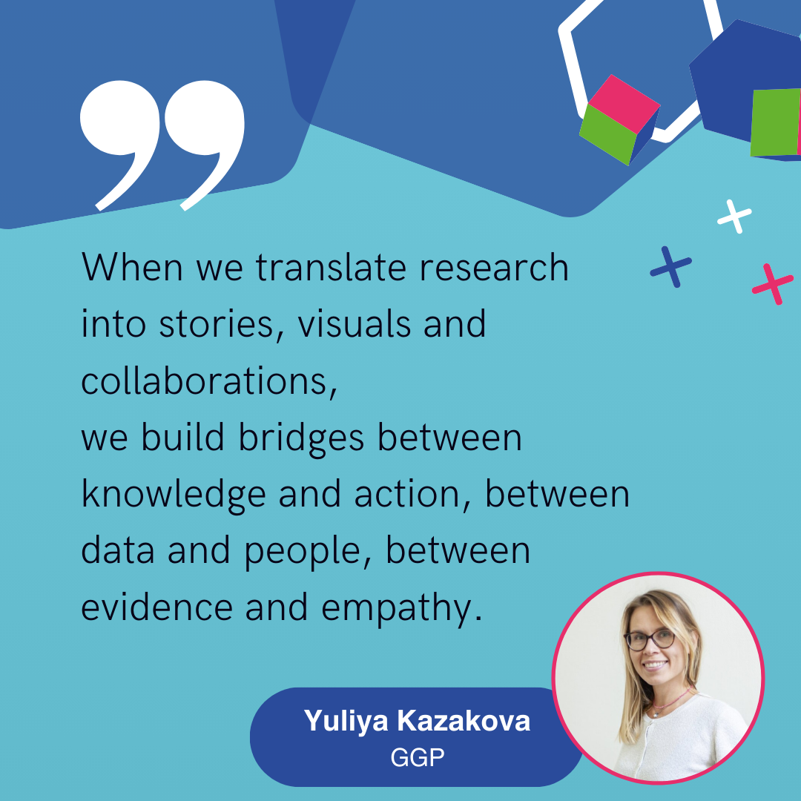

<!--
author: Lisa Hirsch
email: info@aussda.at
version:  1.0.0
narrator: UK English Female
comment:  This course gives an introduction to the ideas of Science Communication. For more information including the suggested citation, please refer to the Readme.md file.
link:     https://cdn.jsdelivr.net/chartist.js/latest/chartist.min.css
script:   https://cdn.jsdelivr.net/chartist.js/latest/chartist.min.js
-->

# Introduction

Welcome to the [Infra4NextGen](https://infra4nextgen.com/) course on Science Communication!

This course introduces the basics of Science Communication and how to put these into practice.  

[Section 1](#3): Basics of Science Communication: what, and why 

[Section 2](#7): The Big 4: who, how, why and where?

[Section 3](#12): Checklist   

[Summary](#13)

[Bibliography](#14)

Why should you take this course? Science communication is becoming increasingly important: Researchers are trained well in communicating their research results to other academics, but in order to combat common challenges like climate change, effective communication beyond the scientific community is crucial. If you want to learn more about how to make your research results have increased impact on society, this course is for you!  

<!-- style="background-color: #6EC7D9;"--> 
> It will take about 60 minutes to complete this module. 

## Objectives and Learning Outcomes

By the end of the module, you will:  

* Understand the concept of Science Communication

* Identify which strategies of science communication fit your goals best 

* Apply methods of science communication to effectively reach your intended target groups  

<!-- style="background-color: #6EC7D9;"--> 
> **Pre-requisites to the module**
>
> You do not need any other courses to take this course. You might need administrator rights to install some of the programs, but we are focussing on non-proprietary software in this course.

<!-- style="background-color: #E72E6B; color: white"--> 
> **A note on knowledge checks and quizzes**
>
> We have added some knowledge checks throughout the course so you can test your knowledge after each section. You will not be graded on these quizzes, but we invite you to take them to check if you understood certain sections. 
> You can get some hints by clicking onto the light bulb icon below each quiz, and reveal the solution by clicking on the checkmark. 

Ready to dive into the world of Science Communication? 

Go ahead to [Section 1 on the basics of Science Communication](#3)!

----
 

# Section 1: Basics of Science communication: what, and why 

In this section you will read up on the basics of Science Communication: what is it, and why does it matter? We want to set you up to understand the basics, before showing you how to actually engage in Science Communication yourself!  

## 1.1 What is Science Communication?
Science communication is all communication efforts about science, scientific results and findings. Communication research uses the concept of framing to underline that communication only gets meaning in its context and depends on how a message is being constructed – or “framed”. Take a look at different definitions below:  

Listen what our experts have to say about the impact of Science Communication: 

!?[⏯](video/course2-clip1.mp4 "Excerpt from the Infra4NextGen webinar on [*Bridging the gap*](https://infra4nextgen.com/events/webinar-connect-social-research-public-policymakers/)), speaker: Ruxandra Comanaru, City St George's, University of London" )

In science communication, you can give meaning to your results by communicating ("framing") them in a deliberate way. The usual way to do this is by engaging with the academic community – by going to conferences, visiting other academic institutions, attending workshops, publishing in academic journals. However, this is not the only way to communicate and frame your research results.  

<!-- style="background-color: #E72E6B; color: white"--> 
> **__Quiz I__**
>
>Think about the examples of Science Communication given above. Which statements are correct?  
>
>Click on the lightbulb to get some hints!

<!-- data-randomize -->
Science communication... 
- [[X]]  is the basis for societal development.
- [[ ]]  is something the public has to ask for, otherwise no one will do it. 
- [[X]] goes beyond presenting my research results at conferences. 
[[?]] Science Communication does not occur in a vacuum, think about the social setting researchers work in!
[[?]] There are two correct answers.
***
Solution: Science Communcation allows knowledge to be distributed to the public, ultimately allowing real-world change based on scientific findings.
***

## 1.2. How should I start to communicate science?

Imagine you just found a really interesting angle to your current article or data you are working on. Usually, you present different stages of a draft at your department, visit other departments and go to conferences, write and publish an article in a well-regarded journal in your field. You spend a considerable amount of time discussing the details of your research question, the generalisability of results, your hypotheses and your results with colleagues who work on similar topics. Sometimes there is the chance to present your work in a more interdisciplinary setting, which allows you to get feedback from other academics in more or less adjacent fields. Even though the real-world implications of your work feature in the abstract, or a newly written grant proposal, the typical audience of academic research and outputs is fairly small – and mostly other academics. 

But what more could you do? Your university might have a Third Mission statement that codifies how the university should contribute to society. You might be working on a project together with citizen scientists that requires you to share results in a setting that is more than an academic conference. You might be an avid podcast listener and feel a call to share your work in a similar fashion with an interested audience. So, you ask yourself: what else is out there?

You start to think about different, more creative ways to disseminate your research outputs: Going on a podcast, posting to various social media outlets, giving interviews to journalists, visualising your research findings in a dynamic dashboard, attending a Science Slam event in your area.

The list is endless. Which target group can you now reach through these additional outlets? By expanding your means of communication in ways that focus on more than an academic audience, you can reach journalists, the interested public, young people, or non-academics. It allows you to communicate your research to the groups who are actually affected by it! Watch the video below to see what our experts think about why bringing research results to the public eye matters.

!?[⏯](video/course2-clip2.mp4 "Excerpt from the Infra4NextGen webinar on [*Bridging the gap*](https://www.youtube.com/watch?v=zZxtWySc2vI), speaker: Yuliya Kazakova, Netherlands Interdisciplinary Demographic Institute" )

In a nutshell, this means that science communication is something else than what we typically think of when we think about where researchers present their work, to whom, and how. 

<!-- style="background-color: #E72E6B; color: white"--> 
> **__Quiz II__**
>
>Take some time to read through the scenarios above again, then tick all correct answers below. 
>
>Click on the lightbulb to get some hints!

<!-- data-randomize -->
Science communication addresses... 
- [[X]]  academic audiences as well as other audiences.
- [[ ]]  academics only. 
- [[X]] the interested public.
- [[X]] journalists.
- [[X]] policy makers.
[[?]] Science Communication is all communication that addresses recipients in- and outside of academia in creative ways. 
[[?]] There are four correct answers.
***
Solution: The statement that science communication addresses only academics is not correct. The goal of science communication is exactly the opposite, by bridging the gap between research results and non-academic audiences.
***

<!-- style="background-color: #E72E6B; color: white"--> 
> **__Quiz III__**
>
>Which activities are suitable for communcation science effectively to non-academic audiences? 
>
>Click on the lightbulb to get some hints!

<!-- data-randomize -->
When communicating research results effectively to a larger audience, you...
- [[X]]  do social media posts.
- [[ ]]  publish only in academic journals. 
- [[X]] give interviews.
[[?]] Science Communication is all communication that addresses recipients in- and outside of academia in creative ways. 
[[?]] There are two correct answers.
***
Solution: Academic journals are not accessible to the wider public. Science communication happens in alternative venues, such as on Social Media, in news outlets, in podcasts, at community events, and many more.
***

## 1.3. Why should I care about Science Communication?
Science communication is – in contrast to publications in high ranking academic journals – not awarded in the same way. So why should you do it then?  

There are several reasons: First, you are the person who is most excited about your research, and you know which impact it can have on people’s lives! This means that you are the best person to let others know what you are working on, and explain to them in tangible ways why what you do matters. Keep in mind that this is a bit different than what reviewers expect when they ask you why the research gap you are closing matters: This is more about the implications of your findings. Think about why anyone who is not an expert in your filed, has read all recent articles and understands the literature should be excited, curious and wanting more!  Watch the video below to dive deeper into the reasons why Science Communication matters!

!?[⏯](video/course2-clip3.mp4 "Excerpt from the Infra4NextGen webinar on [*Bridging the gap*](https://www.youtube.com/watch?v=zZxtWySc2vI), speaker: Yuliya Kazakova, Netherlands Interdisciplinary Demographic Institute" )

Implications of research do not only matter to the individuals who are affected by them, but are also a way for policy makers to make more informed and thus better decisions for their constituents. Now, most policy makers do not have the capacity to keep up with the rapidly changing landscape of academic literature. Instead, they rely on researchers to brief them about findings. If scientific findings are not communicated outside of academia, policy makers face the challenge to make decisions without evidence, and the public might have to rely on misinformation or lacks knowledge to adequately judge information.  

All of this does not mean that you should not work on your publication list, go to conferences, and establish your academic track record. After all, we know that these outputs are the indicators that will give you an academic job. But bringing your results closer to the people – whatever that means – benefits them, society as a whole and you! Additional outlets beyond academic publications are not only benefitting society but also you as a researcher: They allow you to be more visible, which in turn facilitates collaboration with other researchers, interested parties and the media. 

<!-- style="background-color: #E72E6B; color: white"--> 
> **__Quiz IV__**
>
>Take a second to think about what you read here about the potential benewfits of Science Communication. Then tick all correct statements. 
>
>Click on the lightbulb to get some hints!

<!-- data-randomize -->
Science Communication benefits.. 
- [[ ]]  funders.
- [[X]]  society. 
- [[X]] the individual researcher.
[[?]] Science Communication is all communication that addresses recipients in- and outside of academia in creative ways. 
[[?]] There are two correct answers.
***
Solution: Academic journals are not accessible to the wider public. Science communication happens in alternative venues, such as on Social Media, in news outlets, in podcasts, at community events, and many more.
***

<!-- style="background-color: #6EC7D9;"--> 
> In this first section, you learned about the basics of science communication and what it is: communication of research findings tailored to non-academic audiences and non-academic venues.
>
> Go to the [next section](#7) to see where to start! 

# Section 2: The Big 4: Who, how, why and where?

Why isn’t dissemination of research results to non-academic audiences always done? Apart from lack of time and monetary resources, there are a few other obstacles that make Science communication harder for researchers.  

Look at what our academic experts have identified as these obstacles: 

!?[⏯](video/course2-clip4.mp4 "Excerpt from the Infra4NextGen webinar on [*Bridging the gap*](https://www.youtube.com/watch?v=zZxtWySc2vI), speaker: Yuliya Kazakova, Netherlands Interdisciplinary Demographic Institute" )

Read more on how to tackle these obstacles now and press [next](#8) to learn who to address, how, why and where! 

## 2.1. Who? Your audience 

Who you are addressing by communicating your research results matters! Imagine an investigative journalist who knows a lot about climate change and is really gifted in writing nail-biting in-depth articles and needs data on perceptions of climate change in the region they are covering as background material for their story. Now, they find a research article of yours – the title hints towards containing exactly what they need because your research was on how tax redistribution towards measures fighting climate change impacts public perception of climate threats, but when they want to read more than the abstract, they realise it is paywalled. Luckily, their employer has enough funds to pay for access to that one article, which they happily read. Upon getting to the results section, they stumble over tables and plots they do not understand. Frustrated, they give up and use another news article to back up theirs, but no primary research results.

Different groups of different people have different skills. For the journalist in our scenario, understanding and interpreting regression tables and marginal effects plots is not possible because they do not have the skills. While basic data literacy is always good to have, even academics of different fields sometimes struggle to understand the way results are presented in other fields. In another scenario, you might also be interested in communicating your findings to pupils – in order to foster trust in science and provide information to the next generation. These will have very different skill sets – and need a very different style of communication – than the journalists before. Policy makers could be another target group of yours that have yet another skill set they can rely on when reading, listening to or watching you! This means that in order to effectively communicate your findings in science communication, you need to take the skill level of your audience into account.

Another characteristic of your audience that matters is language: Different addressees speak and understand different languages. Here, it is important to think about the language you are communicating in in contrast to the language your audience speaks primarily, but also about the technicality of the language used. If you are a researcher in a non-English speaking country, and you want to communicate your findings on interesting results that have implications for society and people’s everyday lives - this could be anything from childrens’ learning trajectories in kindergarten, the benefits children get from playing outside, how to combat climate change or how to safeguard democracy against anti-democratic tendencies - to the broader public, you should probably not do that in English, as you would usually do for your publications. You will reach more people by communicating in the local language. In the same vein, avoid technical terminology as a way to allow a broader audience to access, read, understand and access your findings!

Knowing who to address prevents speaking a language your audience does not understand, so you prevent this situation:

## 2.2. How? Methods and hard skills 

After thinking about the who you are communicating to, the how matters – and this relates directly to both skills, and language mentioned previously! Regression tables might be a fitting way of presenting the size, direction, and significance of effects in an academic journal, but science communication relies on more easily understandable forms of presentations, like visuals and graphics, easily understandable text and short tables.  

Take a look at one of the Topline reports our colleagues produced. XXX You can see how it is easy to understand etc  XXXX

Visualisation of data is a powerful tool to present your results in a way your audience can easily digest and for you to get the information across. Let us take a look at what our experts have to say about what visualisations actually are:  

!?[⏯](video/course2-clip5.mp4 "Excerpt from the Infra4NextGen webinar on [*Data Visualization with R Studio*](https://www.youtube.com/watch?v=Qz1Z855xPIg), speaker: Franz Eder, University of Innsbruck" )

What now makes a graph a good graph? Similarly, what makes a text a good text or a table a good table? In Science Communication you will always face the tradeoff between simplicity and complexity. Getting that balance right for your audience (non-academic, non-specialised, different method skills) is crucial to effective communication: It should reduce the complexity of what is shown in a manner that you can make sure your audience gets what you are saying! Watch the video below for more details about these questions:

!?[⏯](video/course2-clip6.mp4 "Excerpt from the Infra4NextGen webinar on [*Data Visualization with R Studio*](https://www.youtube.com/watch?v=Qz1Z855xPIg), speaker: Franz Eder, University of Innsbruck" )

Remember, when you communicate your research findings you are telling a story - and the more engaging you combine visualisation, texts and tables, the better your audience can follow you! Now, think back to the beginning of this course and the concept of frames. Here is where they become relevant to your work: How do you want to frame your research? What is the story you want to tell? While telling your story, do use examples and analogies that link your research findings to actual  experiences people have and make in their lives. Don’t be afraid this  could “dilute” your research or makes it banal. Instead, you emphasize  how your research is relevant beyond the scientific community. Ideally,  you will help to strengthen trust in science through convincing science  communication.   

## 2.3. Why? Your goal

If you are unsure about what the story you want to tell is, answering one central question will be helpful: Why are you communicating your results? Knowing what your goal is helps you to shape your communication effectively.  

There are a few possibilities here: You might simply want to convey information about a topic you care about. Imagine you are a climate scientist and want to accurately portray your newest results in order to inform the public, journalists and media outlets better. Your goal is to provide information, avoid and combat disinformation, and inform the public. Your goal is to increase information that is available to the public.  

Now think about another scenario with another audience: You want to inform policy makers so they can make more informed decisions: This is the basis for evidence-based policy making. 

Another one of your goals might be to strengthen the public’s trust in  science: You make transparent how you arrived at your research findings,  you might explain some ethical challenges and how you addressed them,  or may even share how one approach did not produce the results you  expected, so you had to modify your method. You explain that research is  a human process and lift the veil a little. 

You might also want to do take it a step further and do more than conveying information – you might want to call for action! After presenting your results, consider if there is an action that you think should be taken in accordance with your results: What should people now do after they have learned about your results? For example, in a video where you present your results on climate change, you could include a call to action to reduce carbon emissions by riding a bike to work instead of driving a car. In a policy brief where your lay out the same results to policy makers you could formulate a policy recommendation to push for policies that tax fossil fuels at a much higher rate than before – this would be a call to action for policy makers.

## 2.4. Where? Different formats and venues

Now, that you have settled on the who, how and why, the next crucial step is to think about where to publish your work.  

Publishing in this sense refers to a broad variety of activities – posting on social media, making videos and posting them to social media, giving interviews in news outlets, sending your policy briefs including policy recommendations to policy makers, going on your favourite podcast as a guest speaker, or attending a Science Slam. Be proactive about reaching out to hosts, checking out local events and do not be afraid to dance your research! 

One way to get started is to think where you access information, and how you could use these outlets to disseminate your findings in turn.  For example, if you use any Social Media platform you can create visuals to disseminate your findings: 

It is also helpful to consult people who are not researchers or academics or who are in a different age group than you or to directly contact your target group and ask them where they get information from, where  they learn about news and developments in science. Take into consideration that  “traditional” media such as the radio may also play an important role here. 

Last, but not least: The who, why, how and where of Science Communication interact! Depending on the platform - and thus the target audience - you choose, the style of communication changes. Imagine a TikTok video in comparison to an interview on a radio show: One has more visual elements, is faster, the other one is more verbal, and most likely longer. Note: There is no “one better way” to engage in Science Communication – you just need to be intentional about it!

<!-- style="background-color: #6EC7D9;"--> 
> In this section, you learned about the who, how, why and where of Science Communication. You understand that the who, how, why and where interact and have a direct impact on your communication style! 
> You now understand the basics of Science Communication, and we give the torch back to you to get started with your first project, to reach out to new audiences and disseminate your findings.
>
> Go to the [next section](#12) for a useful checklist, and practical tips and tools! 

# Checklist

You can use the checklists below to help you visualise your ideas. 

** Who is your audience **
- [ ]  policy makers 
- [ ]  journalists
- [ ]  Pupils / students
- [ ] The general public

** How **
- [ ]  Data visualisation
- [ ]  Text based for traditional media, news article, blog post
- [ ]  Text for other outputs, science slam etc
- [ ]  Video (audio and visuals)

** Why **
- [ ]  Provide information
- [ ]  Increase information available to aid evidence-based policy making 

** Where **
- [ ]  Traditional media outlet: newspaper
- [ ]  Traditional media outlet: radio
- [ ]  New media outlet: podcast
- [ ]  Social media outlet: video platform

This checklist gives you an overview over your 
Now, take a look at the suggestions below on how to start your science communication strategy! 

First, pick an audience. Then flip the card to reveal where to start!
<lia-keep>

  

    

      <h3 class="flip-card-front">Policy makers</h3>
      

        <h3>Findable</h3>
        Start by boiling down your results to the core points you want policy makers to be informed about. 
      

    

  

</lia-keep>

Flipcard front: Students – Flipcard back: Select the “where”: If you want to present your findings in person, contact schools in your area! 

# Summary
Congratulations! You completed the course “Science Communcation”! In this course you learned about the basics of science communication, why it mattters, how it can benefit both you and others and the four questions to help you get started: who are you communicating to, how, why and where? 

You now have an overview over different possibilities and a checklist that you can use for your next communication effort. Check out the supporting resources section if you want to dive deeper into the topic, want to find and use templates and find and connect with colleagues! 

We are continually updating the course and incorporating feedback, so please do not hesitate to contact us via [AUSSDA](mailto:info@aussda.at). If you are interested in live events hosted by the Infra4NextGen project, please visit the [I4NG events site](https://infra4nextgen.com/i4ng-events/forthcoming-events/) and come join us at one of our events - we are hosting webinars, workshops and datathons regularly!   

<!-- style="background-color: #6EC7D9;"--> 
>__Where to go from here?__
>
>  If you want to dive deeper into the theoretical background, go to the [bibliography](#14)
> If you are interested in some examples how other researchers communicate their findings, head to [The Conversation](https://theconversation.com/europe).

---
  

# Bibliography

Reed, M.S. (2025). The Research Impact Handbook (3rd ed.). Routledge. https://doi.org/10.4324/9781003615019

